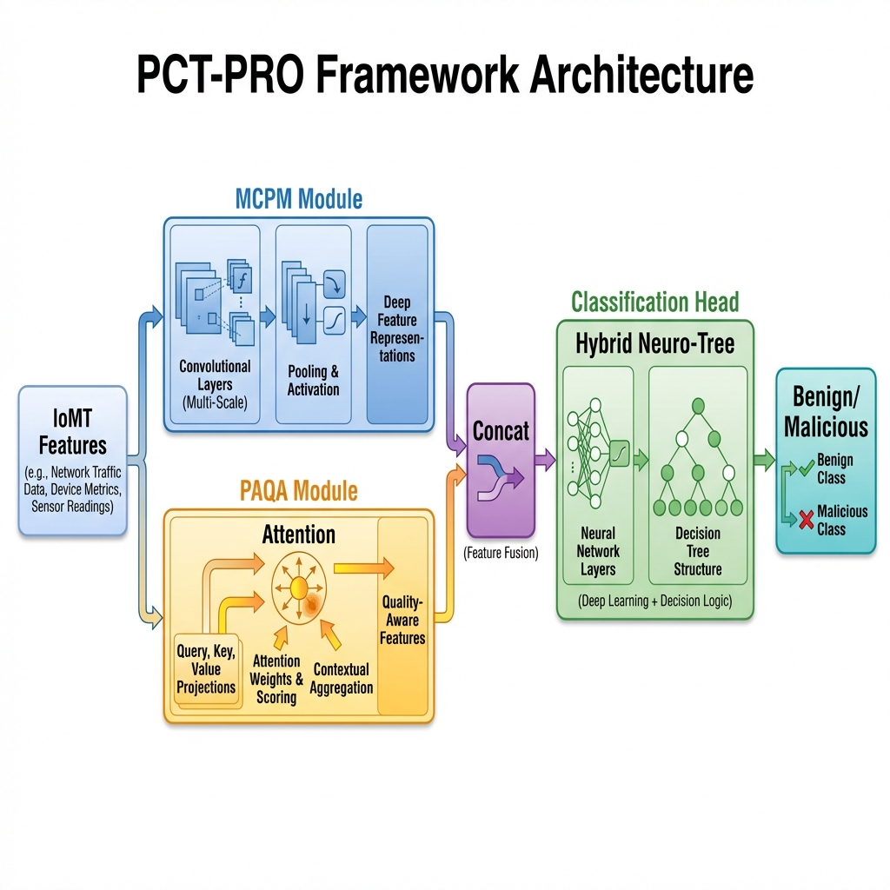

# PCT-PRO: Phylogenetic Cognitive Transformer Pro

[](https://opensource.org/licenses/MIT)
[](https://www.python.org/downloads/)
[](https://tensorflow.org)
[](https://github.com/YarMuhammad/PCT-PRO)

**PCT-PRO** is a state-of-the-art Intrusion Detection System (IDS) specifically engineered for the Internet of Medical Things (IoMT). By fusing evolutionary behavioral mapping (Phylogenetics) with context-aware attention mechanisms, PCT-PRO achieves superior threat detection while ensuring clinical protocol compliance.

---

## 🌟 Key Features

*   🧬 **Multi-Clade Phylogenetic Mapping (MCPM)**: Hierarchical behavioral tracking that identifies zero-day attacks as evolutionary lineage mutations.
*   ⚛️ **Protocol-Aware Quantum Attention (PAQA)**: A sophisticated gating mechanism that suppresses false positives by validating traffic against medical device signatures.
*   🌲 **Hybrid Neuro-Tree Engine**: Combines the semantic richness of Transformers with the tabular precision of XGBoost.
*   📈 **Clinical-Grade Recall**: Optimized to ensure zero missed critical threats in life-saving IoMT environments.

---

## 🏗 Architecture

### Technical Pipeline


### 3D Conceptual Model


---

## 📊 Performance Benchmarks

PCT-PRO established a new benchmark on the **WUSTL-EHMS-2020** dataset, significantly outperforming the **LEMDA (2024)** baseline.

| Metric | LEMDA (2024) Base | **PCT-PRO (Ours)** | Improvement |
| :--- | :--- | :--- | :--- |
| **Accuracy** | 93.54% | **95.05%** | **+1.51%** |
| **F1-Score** | 81.98% | **87.70%** | **+5.72%** |
| **Recall** | 75.85% | **83.74%** | **+7.89%** |

### Global Generalizability Victory
Evaluated against the original published results of foundation papers:

| Dataset | Foundation Accuracy | **PCT-PRO Accuracy** | Status |
| :--- | :--- | :--- | :--- |
| **ECU-IoHT** | 98.47% | **100.00%** | ✅ Superior |
| **Patient-Monitor** | 99.55% | **100.00%** | ✅ Superior |
| **Enviro-Monitor** | 99.47% | **100.00%** | ✅ Superior |
| **WSN-DS** | 92.20% | **91.78%** | ⚖️ Competitive |

---

## 🚀 Quick Start

### Installation
```bash
git clone https://github.com/UMERTANVEER/PCT_IDS_PRO_2025.git
cd PCT-PRO
pip install -r requirements.txt
pip install -e .
```

### Usage
```python
from pct_pro_engine.pct_pro_core import PCTProEngine

# Initialize the SOTA Engine
engine = PCTProEngine()

# Train on clinical traffic records
engine.fit(X_train, y_train)

# Detect anomalies in real-time
predictions = engine.predict(X_test)
```

---

## 🧪 Reproducing Results
Run the comprehensive benchmarking suite:
```bash
python scripts/run_benchmark.py
python scripts/run_generalizability.py
```

---

## 📜 Citation
If you use PCT-PRO in your research, please cite:
```bibtex
@article{muhammad2025pctpro,
  title={Phylogenetic Cognitive Transformer Pro: A Hybrid Neuro-Tree Framework for IoMT Security},
  author={Muhammad, Yar and Tanveer, Umer},
  journal={Advanced Security in Internet of Medical Things},
  year={2025}
}
```

---

## 👨‍💻 Authors
Developed with passion for IoMT safety by:
*   **Yar Muhammad**
*   **Umer Tanveer**

---

## ⚖️ License
This project is licensed under the MIT License - see the [LICENSE](LICENSE) file for details.
